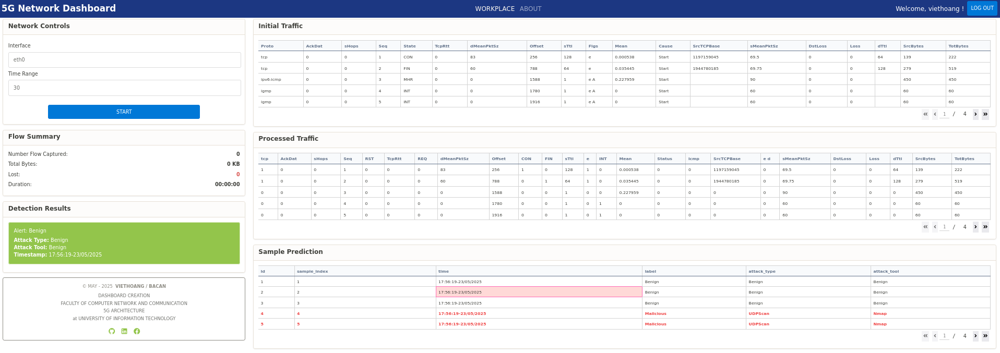
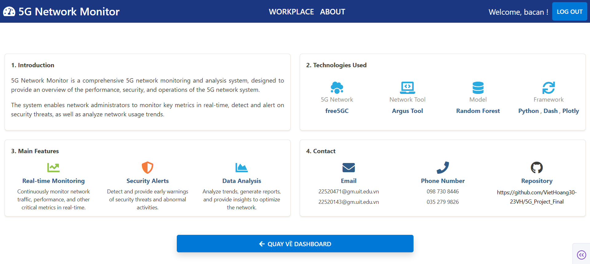

# Building interactive dashboard in order to monitor network traffic in 5G environment 
`This project is conducted by Viet Hoang and Ba Can.`

**I. Introduction** 
- 5G Project relates to monitoring 5G network traffic, visualizing with interactive das, making suggestions to prevent network threats.
- Plotly: graphs, figures: layout, data, trace
- Dash: web python framework.
---
**II. Set up environment**

1. Create python virtual environment
   
        mkdir 5gdashboard
        cd 5gdashboard
        python -m venv mydash5genv
        .\mydash5genv\Scripts\activate
2. Install needed libraries

        sudo pip install -r requirements.txt

3. Deploy locally
        
        python main.py

4. Description about output from command line

- Number Packet Captured: Total, total bytes, Lost, Duration
- Network Flow charts: line charts
- Attack Types Distribution: bar charts 
- Initial Traffic: Table "Proto","AckDat","sHops","Seq", "State", "TcpRtt", "dmeansz","offset","sttl", "flgs", "mean", "cause", "stcpb", "dloss","smeansz","loss", "dttl", "sbytes", "bytes"  
- Processed Traffic: Table 'tcp', 'AckDat', 'sHops', 'Seq', 'RST', 'TcpRtt', 'REQ', 'dMeanPktSz','Offset', 'CON', 'FIN', 'sTtl', ' e        ', 'INT', 'Mean', 'Status', 'icmp',
 'SrcTCPBase', ' e d      ', 'sMeanPktSz', 'DstLoss', 'Loss', 'dTtl', 'SrcBytes', 'TotBytes' 

- Define benign and malicious: figure-factory-table (4.4)
        
        current_time = datetime.datetime.now(pytz.timezone('Etc/GMT-7')).strftime("%H:%M:%S-%d/%m/%Y")
        print(f"Mẫu {idx+1} with [{current_time}]:")
        print(f"  - Label        : {label}")
        print(f"  - Attack Type  : {attack_type}")
        print(f"  - Attack Tool  : {tool}\n")
---
**III. File Structure**

5G_dashboard/
├── 5g_monitor.db
├── app
│   ├── callbacks
│   │   ├── dashboard_callbacks.py
│   │   ├── __init__.py
│   │   ├── login_callbacks.py
│   │   └── __pycache__
│   │       ├── dashboard_callbacks.cpython-312.pyc
│   │       ├── __init__.cpython-312.pyc 
│   │       └──  login_callbacks.cpython-312.pyc
│   ├── __init__.py
│   ├── pages
│   │   ├── about.py
│   │   ├── dashboard.py
│   │   ├── __init__.py
│   │   ├── login.py
│   │   └── __pycache__
│   │       ├── about.cpython-312.pyc
│   │       ├── dashboard.cpython-312.pyc
│   │       ├── data_overview.cpython-312.pyc
│   │       ├── __init__.cpython-312.pyc
│   │       └── login.cpython-312.pyc
│   └── __pycache__
│       └── __init__.cpython-313.pyc
├── components
│   ├── __init__.py
│   ├── navbar.py
│   └── __pycache__
│       ├── __init__.cpython-312.pyc
│       └── navbar.cpython-313.pyc
├── data
│   ├── database.py
│   ├── fetch_data.py
│   ├── __init__.py
│   └── __pycache__
│       ├── database.cpython-312.pyc
│       ├── fetch_data.cpython-313.pyc
│       └── __init__.cpython-313.pyc
├── Dockerfile
├── main.py
├── model
│   ├── 5gModelBuilding.py
│   ├── flowcapture.py
│   └── __pycache__
│       └── flowcapture.cpython-313.pyc
├── my_rf_model.joblib
├── images
├── requirements.txt
└── README.md

---
5. Build UI
Login page 

Dashboard page

About page

---
`This markdown is written by Viet Hoang.`
